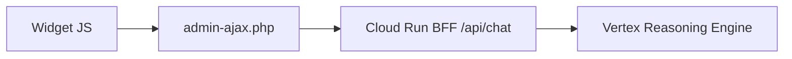

# Plan: Pasarela WP — graceful fallback + historial (staging)

> **Repo:** `pasarela-gcp-wp`  
> **Entorno:** staging (WPCode; admin confirmado)  
> **Agente GCP:** ya desplegado y respondiendo (`7123797409011859456`)  
> **BFF Cloud Run:** `academy-ae-gateway` — verificar conectividad; no editar salvo fallo  
> **Fuera de alcance:** producción, cambios en BFF, cambios en `agente-ae-academy-backend`

---

## Contexto



Contrato WP → BFF (mantener):

```json
{ "message": "último mensaje usuario", "session_id": "wp-{userId}" }
```

El historial que envía el JS a PHP se usa para **validación y UI**; el contexto del agente vive en la sesión Vertex (`wp-{userId}`).

Constantes actuales:

| Constante | Valor |
|-----------|-------|
| `UA_CHAT_COURSE_ID` | `46067` |
| `UA_CHAT_BFF_URL` | `https://academy-ae-gateway-919237484930.us-east1.run.app/api/chat` |
| `UA_CHAT_MAX_MENSAJES` | `80` → cambiar a **24** |
| PHP `$max_items` historial | `40` → cambiar a **24** |

---

## Objetivos

1. **Graceful fallback:** mensajes amigables al alumno (reemplazar *"Error comunicando con el servidor IA"*).
2. **Historial acotado:** 24 mensajes en UI/localStorage + PHP alineado.
3. **Sync de archivos:** `script.js` ↔ `backend.php` ↔ `wp-snippet-tutor-ia.php`.
4. **Despliegue staging:** WPCode + pruebas.
5. **Docs + commit** en este repo.

---

## Archivos a tocar (orden)

| Orden | Archivo | Rol |
|-------|---------|-----|
| 1 | `script.js` | Editar JS primero (dev local con `index.html`) |
| 2 | `backend.php` | Lógica PHP + nowdocs embebidos |
| 3 | `wp-snippet-tutor-ia.php` | **Artefacto staging** — debe quedar idéntico a `backend.php` |
| 4 | `docs/README.md` | Actualizar tablas de config y troubleshooting |

**Regla:** tras editar `script.js`, copiar contenido al nowdoc `UA_CHAT_JS` en `backend.php` y `wp-snippet-tutor-ia.php`.

**Nota:** `wp-snippet-tutor-ia.php` es la versión más completa (localStorage, tooltip quiz). Al sincronizar JS, usar `script.js` / wp-snippet como base, no la JS reducida vieja de `backend.php`.

---

## Cambio 1 — Graceful fallback (PHP)

Archivos: `backend.php` y `wp-snippet-tutor-ia.php`.

### 1a. Nueva función `ua_chat_mensaje_amigable( WP_Error $error )`

| Condición en mensaje de error | Mensaje al usuario |
|------------------------------|-------------------|
| `timeout`, `timed out`, `cURL error 28` | *"El tutor está tardando más de lo habitual. Intenta de nuevo en unos segundos o haz una pregunta más específica."* |
| `429`, `RESOURCE_EXHAUSTED`, `503`, `504` | *"Tu consulta es muy amplia. ¿Podrías indicar el módulo o el tema concreto?"* |
| `sin texto usable`, respuesta vacía | *"No recibí una respuesta del tutor. Intenta reformular tu pregunta."* |
| HTTP 4xx/5xx del BFF | *"No pude conectar con el tutor en este momento. Intenta de nuevo en unos segundos."* |
| Default | Mismo mensaje genérico de conexión |

Detalle técnico solo en `ua_chat_log_error()` (requiere `WP_DEBUG`).

### 1b. `ua_chat_handle_send_message` (~línea 78–81)

Reemplazar mensaje fijo por:

```php
wp_send_json_error(
    array( 'message' => ua_chat_mensaje_amigable( $texto ) ),
    500
);
```

### 1c. `ua_chat_consultar_bff`

- Tras `trim( $decoded['response'] )`, si vacío → `WP_Error( 'ua_chat_bff_empty', ... )`.
- Transport errors: código `ua_chat_bff_transport`.
- HTTP `>= 400`: incluir código en mensaje interno para mapeo.

**No cambiar:** `UA_CHAT_BFF_URL`, timeout 120s, payload JSON.

---

## Cambio 2 — JS muestra mensaje del servidor

Archivo: `script.js` → sync a nowdoc `UA_CHAT_JS`.

En `enviarMensaje`, bloque `catch`:

```javascript
var mensajeError = (error && error.message)
  ? error.message
  : "Lo siento, no pude procesar tu mensaje. Inténtalo de nuevo en unos segundos.";
pintarMensaje("model", mensajeError);
```

**No** guardar mensajes de error en `chatHistory` ni `localStorage`.

`sendMessageToBackend` ya hace `throw new Error(result.data.message)` — compatible con el cambio PHP.

---

## Cambio 3 — Historial acotado

| Constante | Hoy | Nuevo |
|-----------|-----|-------|
| `UA_CHAT_MAX_MENSAJES` (JS) | 80 | **24** |
| `$max_items` en `ua_chat_sanitizar_historial` | 40 | **24** |

---

## Cambio 4 — Sync pre-deploy

1. Editar `script.js` + PHP en `backend.php`.
2. Copiar **todo** `backend.php` → `wp-snippet-tutor-ia.php`.
3. Verificar nowdocs: `<<<'UA_CHAT_JS'` en línea sola.
4. Probar UI en `index.html` (llamada real fallará sin WP — OK).

---

## Cambio 5 — Despliegue staging (manual)

1. Copiar `wp-snippet-tutor-ia.php` completo.
2. WP staging → WPCode → fragmento PHP → pegar y guardar.
3. Hard refresh (Ctrl+F5) en lección del curso 46067.
4. Confirmar `UA_CHAT_BFF_URL` correcto en el snippet.

**No tocar producción.**

---

## Cambio 6 — Pruebas staging

| # | Prueba | Esperado |
|---|--------|----------|
| 1 | Pregunta normal del curso | `success: true`, respuesta tutor |
| 2 | *"materiales de apoyo"* / pregunta amplia | Respuesta o mensaje amigable |
| 3 | URL BFF inválida temporal | Burbuja amigable, no *"Error comunicando..."* |
| 4 | DevTools → `admin-ajax.php` | JSON con `message` o `text` |
| 5 | Lección → cuestionario | Historial persiste; máx. 24 msgs |
| 6 | `WP_DEBUG` on | `[UA Chat][bff]` en error_log |

Regresión agente (post-deploy backend):

- *"Dame las herramientas tecnológicas que el curso ofrece"* → URL App.
- *"¿De dónde sacas esa información?"* → sin filtraciones técnicas.

---

## Cambio 7 — BFF checklist (Cloud Run)

Antes de pruebas staging:

- [ ] `/api/chat` responde 200 con pregunta de prueba
- [ ] `session_id` se reenvía a Vertex
- [ ] Engine ID = `7123797409011859456`

Si ya respondía bien post-deploy del agente, **no editar Cloud Run**.

---

## Cambio 8 — Docs y Git

Actualizar `docs/README.md`: constantes 24, tabla mensajes amigables, troubleshooting.

Commit sugerido:

```
fix(wp): graceful fallback BFF y historial acotado (staging)
```

---

## Checklist final

- [x] `ua_chat_mensaje_amigable()` implementada
- [x] JS catch usa `error.message`
- [x] Límites historial = 24
- [x] `backend.php` === `wp-snippet-tutor-ia.php`
- [x] `script.js` sincronizado
- [ ] Snippet en staging WPCode
- [ ] 6 pruebas OK
- [x] `docs/README.md` actualizado
- [ ] Commit/push repo
